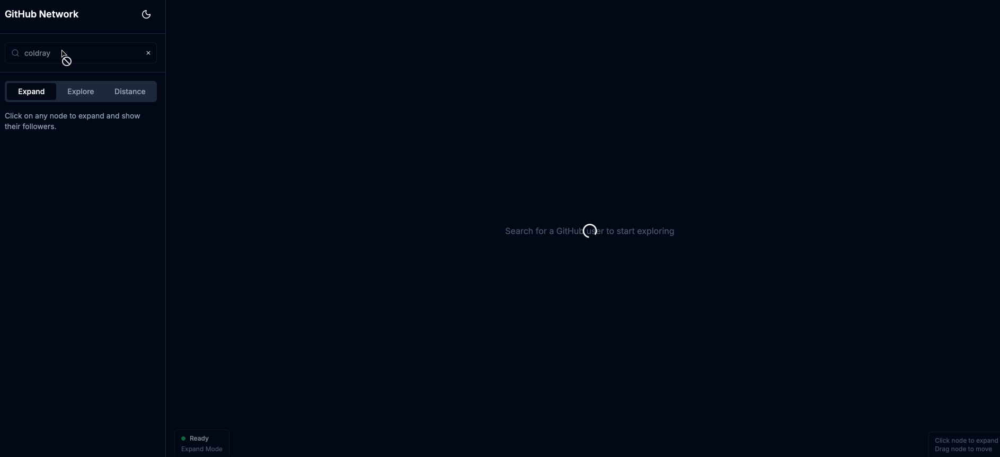

# GitHub Social Network

A visualization tool for exploring GitHub user connections and finding the shortest path between developers.

## Features

- **Search**: Find GitHub users with autocomplete
- **Expand**: Click on any node to expand and show their followers
- **Explore**: View detailed user information (bio, location, company, repos, etc.)
- **Distance**: Calculate the degrees of separation between two users using BFS

## Getting Started

### Prerequisites

- Node.js 18+
- npm or yarn
- GitHub Personal Access Token

### Setup

1. Clone the repository:
   ```bash
   git clone <repo-url>
   cd github-social-network
   ```

2. Install dependencies:
   ```bash
   npm install
   ```

3. Create a GitHub Personal Access Token:
   - Go to https://github.com/settings/tokens
   - Click "Generate new token (classic)"
   - No special scopes are needed for public user data
   - Copy the generated token

4. Set up environment variables:
   ```bash
   cp .env.example .env.local
   ```
   Then edit `.env.local` and replace the placeholder with your token:
   ```
   GITHUB_TOKEN=ghp_your_token_here
   ```

5. Start the development server:
   ```bash
   npm run dev
   ```

6. Open [http://localhost:3000](http://localhost:3000) in your browser

## Usage

### Expand Mode (Default)
- Search for a GitHub user to start
- Click on any node to expand and show their followers
- The graph will grow as you explore connections

### Explore Mode
- Click on any node to view detailed user information in the sidebar
- See bio, location, company, follower counts, and join date

### Distance Mode
- Click on two different nodes to select them
- Click "Calculate Path" to find the shortest path
- The path will be highlighted in green on the graph
- Shows degrees of separation between users

## Tech Stack

- **Framework**: Next.js 14 (App Router)
- **Language**: TypeScript
- **Styling**: Tailwind CSS
- **UI Components**: shadcn/ui
- **Graph Visualization**: react-force-graph-2d
- **State Management**: Zustand
- **GitHub API**: Octokit

## Project Structure

```
github-social-network/
├── app/
│   ├── layout.tsx              # Root layout with providers
│   ├── page.tsx                # Main page
│   └── api/github/             # API routes for GitHub
├── components/
│   ├── ui/                     # shadcn/ui components
│   ├── graph/                  # Graph visualization
│   ├── search/                 # User search
│   └── panels/                 # Info panels
├── hooks/                      # Custom React hooks
├── lib/                        # Utilities and helpers
├── store/                      # Zustand store
└── types/                      # TypeScript types
```

## License

MIT




GIF created with [LiceCap](http://www.cockos.com/licecap/).